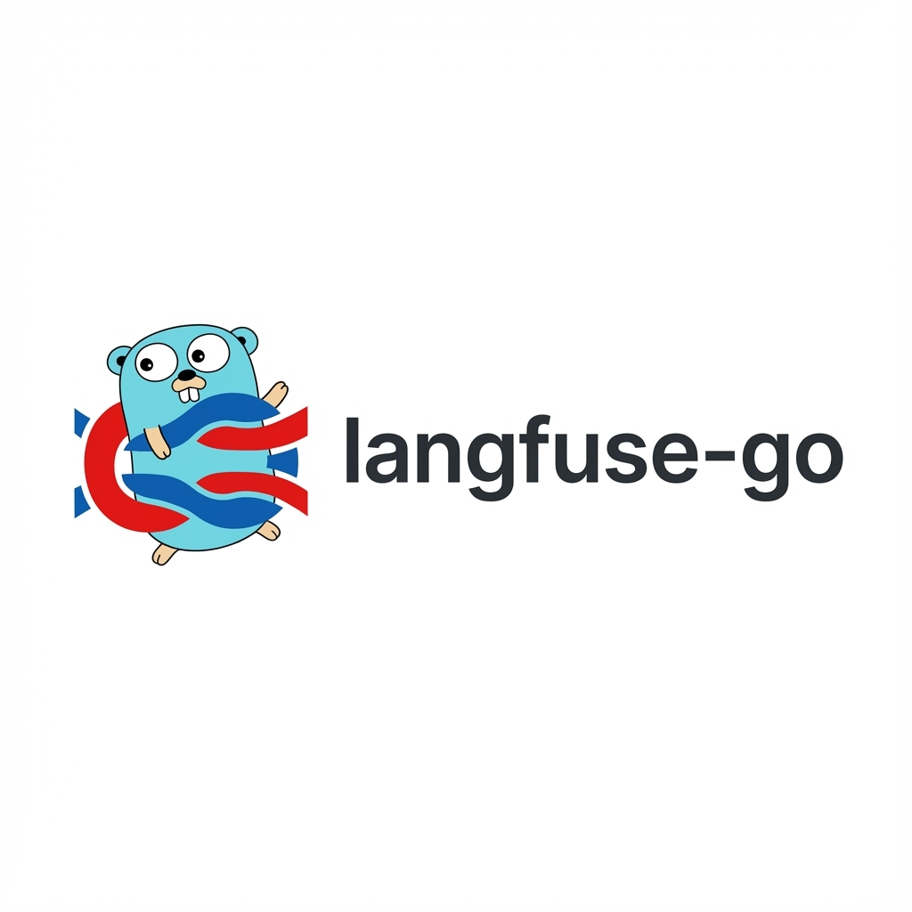

<p align="center">
  
</p>

<h1 align="center">Langfuse Go SDK</h1>

<p align="center">
  <a href="https://github.com/AEKurt/langfuse-go/actions/workflows/test.yml"></a>
  <a href="https://github.com/AEKurt/langfuse-go/actions/workflows/test.yml"></a>
  <a href="https://goreportcard.com/report/github.com/AEKurt/langfuse-go"></a>
  <a href="https://pkg.go.dev/github.com/AEKurt/langfuse-go"></a>
</p>

<p align="center">
  <strong>Unofficial Go SDK for <a href="https://langfuse.com">Langfuse</a> - an open-source LLM engineering platform.</strong>
</p>

## Installation

```bash
go get github.com/AEKurt/langfuse-go
```

## Quick Start

```go
package main

import (
    "context"
    "fmt"
    "log"
    "time"

    "github.com/AEKurt/langfuse-go"
)

func main() {
    // Initialize the client
    client, err := langfuse.NewClient(langfuse.Config{
        PublicKey: "your-public-key",
        SecretKey: "your-secret-key",
        // Optional: BaseURL defaults to https://cloud.langfuse.com
        // BaseURL: "https://cloud.langfuse.com",
    })
    if err != nil {
        log.Fatal(err)
    }

    // Create a trace
    ctx := context.Background()
    now := time.Now()
    trace, err := client.CreateTrace(ctx, langfuse.Trace{
        Name:      "my-trace",
        UserID:    "user-123",
        Metadata:  map[string]interface{}{
            "environment": "production",
        },
        Tags:      []string{"important", "test"},
        Timestamp: &now,
    })
    if err != nil {
        log.Fatal(err)
    }
    fmt.Printf("Created trace: %s\n", trace.ID)

    // Create a generation (LLM call)
    startTime := time.Now()
    generation, err := client.CreateGeneration(ctx, langfuse.Generation{
        TraceID: trace.ID,
        Name:    "chat-completion",
        Model:   "gpt-4",
        StartTime: &startTime,
        Input: map[string]interface{}{
            "messages": []map[string]interface{}{
                {"role": "user", "content": "Hello!"},
            },
        },
        Usage: &langfuse.Usage{
            Input:  10,
            Output: 20,
            Total:  30,
            Unit:   "TOKENS",
        },
    })
    if err != nil {
        log.Fatal(err)
    }

    // Update the generation with output
    endTime := time.Now()
    _, err = client.UpdateGeneration(ctx, generation.ID, langfuse.GenerationUpdate{
        EndTime: &endTime,
        Output: map[string]interface{}{
            "messages": []map[string]interface{}{
                {"role": "assistant", "content": "Hi there!"},
            },
        },
    })
    if err != nil {
        log.Fatal(err)
    }

    // Create a span
    spanStart := time.Now()
    span, err := client.CreateSpan(ctx, langfuse.Span{
        TraceID: trace.ID,
        Name:    "database-query",
        StartTime: &spanStart,
        Input: map[string]interface{}{
            "query": "SELECT * FROM users",
        },
    })
    if err != nil {
        log.Fatal(err)
    }

    // Update span with output
    spanEnd := time.Now()
    _, err = client.UpdateSpan(ctx, span.ID, langfuse.SpanUpdate{
        EndTime: &spanEnd,
        Output: map[string]interface{}{
            "rows": 42,
        },
    })
    if err != nil {
        log.Fatal(err)
    }

    // Create a score
    _, err = client.Score(ctx, langfuse.Score{
        TraceID: trace.ID,
        Name:    "quality",
        Value:   0.95,
        Comment: "High quality response",
    })
    if err != nil {
        log.Fatal(err)
    }
}
```

## API Reference

### Client

#### `NewClient(config Config) (*Client, error)`

Creates a new Langfuse client.

**Parameters:**
- `config.PublicKey` (string, required): Your Langfuse public key
- `config.SecretKey` (string, required): Your Langfuse secret key
- `config.BaseURL` (string, optional): Base URL for Langfuse API (defaults to `https://cloud.langfuse.com`)
- `config.HTTPClient` (*http.Client, optional): Custom HTTP client

### Traces

#### `CreateTrace(ctx context.Context, trace Trace) (*TraceResponse, error)`

Creates a new trace.

#### `UpdateTrace(ctx context.Context, traceID string, trace TraceUpdate) (*TraceResponse, error)`

Updates an existing trace.

### Spans

#### `CreateSpan(ctx context.Context, span Span) (*SpanResponse, error)`

Creates a new span.

#### `UpdateSpan(ctx context.Context, spanID string, span SpanUpdate) (*SpanResponse, error)`

Updates an existing span.

### Generations

#### `CreateGeneration(ctx context.Context, generation Generation) (*GenerationResponse, error)`

Creates a new generation (LLM call).

#### `UpdateGeneration(ctx context.Context, generationID string, generation GenerationUpdate) (*GenerationResponse, error)`

Updates an existing generation.

### Events

#### `CreateEvent(ctx context.Context, event Event) (*EventResponse, error)`

Creates a new event.

### Scores

#### `Score(ctx context.Context, score Score) (*ScoreResponse, error)`

Creates a score for a trace or observation.

## Examples

### Getting Started

See the `examples/getting_started/` directory for a simple step-by-step example.

### Basic Examples

See the `examples/basic/` directory for basic usage examples.

### Advanced Examples

See the `examples/advanced/` directory for advanced features including:
- W3C Trace Context support
- Context manager pattern (Go equivalent of Python's `with` blocks)
- Trace context propagation
- Nested observations
- Different observation types

### Observe Wrapper Examples

See the `examples/observe_wrapper/` directory for examples of wrapping functions with automatic observation tracking.

### Error Handling Examples

See the `examples/error_handling/` directory for examples of handling errors and edge cases.

### Logger Examples

See the `examples/logger/` directory for examples of using the logger interface for debugging.

### Context Propagation Examples

See the `examples/context_propagation/` directory for examples of propagating trace context across services.

### Async/Batch Processing Examples

See the `examples/async_batch/` directory for examples of high-performance async batch processing:
- Background batch processing with configurable settings
- High-volume concurrent writes
- Manual flush and graceful shutdown

### Specialized Observation Types Examples

See the `examples/observation_types/` directory for examples of specialized observation types:
- Agent, Tool, Chain, Retriever
- Embedding, Evaluator, Guardrail
- Context management with `StartAsCurrent*` methods

## Advanced Features

### W3C Trace Context

Generate W3C-compliant trace and observation IDs:

```go
// Generate deterministic trace ID from external ID
externalID := "req_12345"
traceID := langfuse.CreateTraceID(externalID)

// Generate observation ID
obsID := langfuse.CreateObservationID()

// Get current trace/observation from context
if traceID, ok := langfuse.GetCurrentTraceID(ctx); ok {
    fmt.Printf("Current trace: %s\n", traceID)
}
```

### Context Manager Pattern

Use `StartObservation` for automatic parent-child relationships:

```go
// Start a root span
rootSpan, err := client.StartObservation(ctx, langfuse.ObservationTypeSpan, "my-operation", input)
if err != nil {
    return err
}
defer rootSpan.End()

// Create child observations
child, err := rootSpan.StartChildObservation(langfuse.ObservationTypeGeneration, "llm-call", prompt)
if err != nil {
    return err
}
defer child.End()

// Update observations
rootSpan.Update(langfuse.SpanUpdate{
    Output: result,
})
```

### Trace Context Propagation

Propagate trace context across services:

```go
// Create trace context
traceCtx := langfuse.TraceContext{
    TraceID: "existing-trace-id",
    SpanID:  "parent-span-id",
}
ctx := langfuse.WithTraceContext(ctx, traceCtx)

// New observations will join the existing trace
span, err := client.StartObservation(ctx, langfuse.ObservationTypeSpan, "downstream-task", input)
```

### Async/Batch Processing

Use `AsyncClient` for high-performance production workloads:

```go
// Create async client with batch processing
client, err := langfuse.NewAsyncClient(
    langfuse.Config{
        PublicKey: "pk-xxx",
        SecretKey: "sk-xxx",
    },
    langfuse.BatchConfig{
        MaxBatchSize:  100,              // Flush when 100 events queued
        FlushInterval: 5 * time.Second,  // Or flush every 5 seconds
        MaxRetries:    3,                // Retry failed requests
        OnError: func(err error, events []langfuse.BatchEvent) {
            log.Printf("Failed to send %d events: %v", len(events), err)
        },
    },
)
if err != nil {
    log.Fatal(err)
}
defer client.Shutdown() // Always shutdown to flush pending events

// Async operations return immediately
traceID, _ := client.CreateTraceAsync(langfuse.Trace{Name: "my-trace"})
spanID, _ := client.CreateSpanAsync(langfuse.Span{TraceID: traceID, Name: "my-span"})

// Force flush when needed (e.g., before response)
client.Flush()
```

### Specialized Observation Types

Use specialized observation types for better categorization:

```go
// Agent - reasoning blocks using LLM guidance
agent, _ := client.StartAgent(ctx, "my-agent", input)
defer agent.End()

// Tool - external tool calls (e.g., APIs)
tool, _ := client.StartTool(ctx, "api-call", input)
tool.Update(langfuse.SpanUpdate{Output: response})
tool.End()

// Chain - connecting LLM application steps
chain, _ := client.StartChain(ctx, "rag-chain", input)

// Retriever - data retrieval (e.g., vector stores)
retriever, _ := client.StartRetriever(ctx, "vector-search", query)

// Embedding - LLM embedding calls
embedding, _ := client.StartEmbedding(ctx, "embed", "text-embedding-3-small", text)

// Evaluator - assessing LLM outputs
evaluator, _ := client.StartEvaluator(ctx, "quality-check", response)

// Guardrail - protection against jailbreaks
guardrail, _ := client.StartGuardrail(ctx, "safety-filter", content)
```

Context-aware variants store the observation in context:

```go
// Returns new context with observation stored
ctx, agent, _ := client.StartAsCurrentAgent(ctx, "my-agent", input)
defer agent.End()

// Get current observation from context
if obs, ok := langfuse.GetCurrentObservation(ctx); ok {
    fmt.Printf("Current: %s\n", obs.ID)
}

// Update current span via context
client.UpdateCurrentSpan(ctx, output, metadata)
```

## Development

### Prerequisites

- Go 1.21 or later
- [golangci-lint](https://golangci-lint.run/) (optional, for linting)
- [go-test-coverage](https://github.com/vladopajic/go-test-coverage) (optional, for coverage checks)

### Testing

Run the test suite:

```bash
go test ./...
# or using make
make test
```

Run tests with race detector:

```bash
go test -v -race ./...
# or using make
make test-race
```

### Coverage

Generate coverage report (opens HTML in browser):

```bash
make coverage
```

Check coverage against thresholds:

```bash
make check-coverage
```

View coverage in terminal:

```bash
go test -cover ./...
```

### Linting

Run linter:

```bash
make lint
```

### Available Make Commands

```bash
make help  # Show all available commands
```

## License

MIT

## Contributing

Contributions are welcome! Please feel free to submit a Pull Request.

Before submitting:
1. Run `make test` to ensure tests pass
2. Run `make lint` to check for code issues
3. Run `make check-coverage` to ensure coverage thresholds are met

